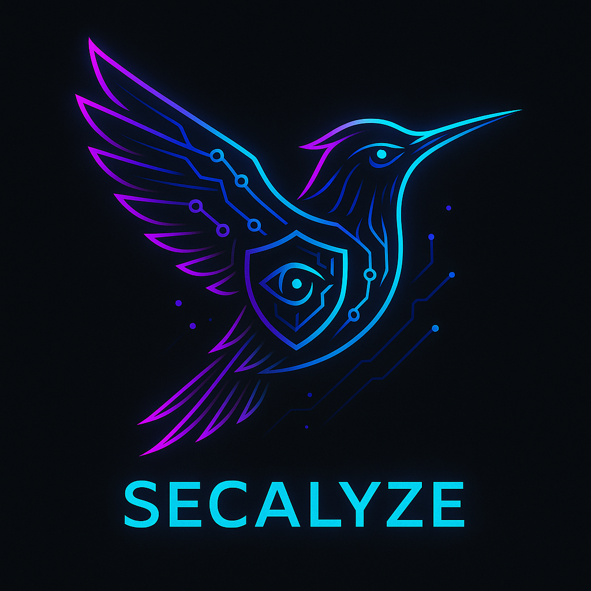

<div align="center">
  
</div>

[](https://www.python.org/downloads/)
[](https://opensource.org/licenses/MIT)

# **Secalyze: AI-Powered Security Analysis and Automation for Modern Security Teams**

Secalyze is an advanced AI-driven security tool designed to empower penetration testers, red team specialists, and cybersecurity engineers. While its primary focus is JavaScript vulnerability scanning, Secalyze offers versatile capabilities for a wide range of security tasks including secrets detection, endpoint discovery, cloud bucket analysis, and custom security automation.

---
<div align="center">
 
</div>
  
### Leveraging Google Gemini AI models, Secalyze delivers:
- **Deep JavaScript Analysis**: Detect XSS, code injection, hardcoded secrets, and sensitive data exposure in JS code
- **Multi-Purpose Security Engine**: Perform custom security assessments using YAML templates
- **Automation-Ready Workflows**: Process single targets or batch operations with structured reporting

---

## Features

- **AI-Powered JavaScript Scanning**: Uses Gemini AI to analyze JavaScript for security vulnerabilities.
- **Customizable Templates**: YAML templates for specific vulnerability detection tasks.
- **Multiple Input Sources**: Scan single URLs, local files, or batch process multiple files.
- **Professional Reporting**: Generate reports with prioritized findings and remediation guidance.
- **Proxy Support**: Configure proxy settings for scanning through corporate networks.

--- 

## Installation

```bash
git clone https://github.com/KaulikMakwana/SecAlyze.git
cd Secalyze

# Create and activate a virtual environment (recommended)
python3 -m venv .venv
source .venv/bin/activate

pip install -r requirements.txt
python Secalyze.py
```
---

## Usage

### Scan a single URL
```bash
python Secalyze.py -u https://example.com -t TEMPLATES/js_vulnerability.yaml
```

### Scan a local JavaScript file
```bash
python Secalyze.py -f path/to/local/file.js -t TEMPLATES/js_vulnerability.yaml
```

### Batch scan multiple URLs from a file
```bash
python Secalyze.py -f urls.txt -t TEMPLATES/api_keys_finder.yaml
```

### Use a different template (e.g., secrets detection)
```bash
python Secalyze.py -u https://example.com -t TEMPLATES/api_keys_finder.yaml
```

### Use for custom tasks
```bash
python Secalyze.py -f nmap-result.txt -p 'Extract All open ports : example 12,22,23.. and then list target service specific pentest tools commands' -mimetype yaml -o output.yaml 
```

### Or just a fun...
```bash
python Secalyze.py -p 'What is the capital of France?' -system 'You are a helpful assistant.'
```

---

## Command Line Options

```text
                   __
               .-/  \__
              /       @`---.
             |   (*)      .'
              \__/`--'---'     .---.  .----.  .-.   .-..----. .---.
                /  /       ___| {_} |/  {}  \ |  `-'  || {}  }| {_}
               /_.'       /__/|____/ \______/ |__/|__/|___.' |_|  

     AI-Powered JS Vulnerability Scanner • Red Team CLI Interface

usage: 
> python3 Secalyze.py -url 'https://example.com/' -p 'Analyse JS scripts and enumerate any Vulns if Exists...' -mimetype text -o JSVulns 

> python3 Secalyze.py -f JSurls.json -p 'Analyze this content for exposed API keys and secrets' -mimetype json -o APIKeys

> python3 Secalyze.py -t TEMPLATES/endpoint_discovery.yaml -f files.json -mimetype x.enum -o endpoints.txt 
    

Secalyze - AI-Powered Multi-Purpose Security Assessment & Automation
CLI

options:
  -h, --help            show this help message and exit
  --update              Check for and install the latest version from GitHub
  --version             Show Secalyze version and exit

Input Options:
  -url, --url URL       target URL ....
  -f, --file FILE       json file contains target links...

AI Model Configuration:
  -system, --system_instruction SYSTEM_INSTRUCTION
                        System instruction for AI model. Default: Expert red
                        team operator instruction
  -p, --prompt PROMPT   Prompt for AI model
  -mimetype, --response_mime_type RESPONSE_MIME_TYPE
                        Response MIME type for AI model output. Accepts: json,
                        text, xml, yaml, x.enum, etc. (or full MIME type)
  -m, --model MODEL     gemini genai model to use.. default: gemini-2.5-flash
                        | gemini-2.5-pro

Template Options:
  -t, --template TEMPLATE_FILE
                        YAML template file for specialized security tasks

Output Configuration:
  -o, --output OUTPUT   Output filename
  -filemode, --filemode FILEMODE
                        File mode for saving output. 'w' for overwrite, 'a'
                        for append. Default: 'a'

Network Configuration:
  -retry, --max_retries MAX_RETRIES
                        Maximum retries for HTTP requests
  -delay, --retry_delay RETRY_DELAY
                        Delay between retries
```

---

## Templates

Secalyze uses YAML templates to define scanning tasks. These templates control the AI's behavior, the task instructions, and the output validation.

### Using a Template
```bash
python Secalyze.py -u https://example.com -t TEMPLATES/js_vulnerability.yaml
```

### Creating a Custom Template
1. Copy an existing template from the `TEMPLATES` directory.
2. Modify the following fields:
   - `system_instruction`: Define the AI's role and task.
   - `task_config`: Set the prompt and any task-specific parameters.
   - `model_config`: Configure the model and output format.
   - `validation` (optional): Add rules to validate the AI's output.
3. Save the new template in the `TEMPLATES` directory and run Secalyze with the `-t` option.

---

## Limitations

- **Static Analysis Only**: Secalyze performs static analysis of JavaScript code and does not execute the code or perform dynamic testing.
- **Model Dependency**: The quality of results depends on the underlying Google Gemini AI models.
- **API Key Required**: You must provide a Google Gemini API key to use this tool.

---

## Future Plans

- **Support for Additional AI Models**: Integration with OpenAI, Anthropic, and local LLMs.
- **Interactive Vulnerability Explorer**: A web-based interface for exploring and prioritizing findings.
- **Functional Calling**: Workflow automation through AI function calling.
- **Enhanced Reporting**: PDF and HTML report generation.
- **CI/CD Integration**: Seamless integration with popular CI/CD platforms.

---

## Legal and Ethical Use

Secalyze is for authorized security testing only. Do not use for illegal activities.
